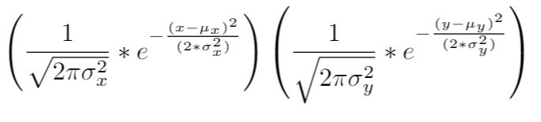

## Universidad de Costa Rica 
## Modelos Probabilísticos de Señales y Sistemas
# Tarea 3: Álvaro Alfaro Miranda - B70224

1. Curva de ajuste (modelo probabilístico) para las funciones de densidad marginales de X y Y.

Al graficar los valores para la Función de Densidad Marginal (FDM) tanto de X como de Y se observó un comportamiento muy similar al de la función de densidad Gaussiana, por lo tanto se eligió esta función para la curva de ajuste. A continuación se muestran los parámetros de la función Gaussiana que mejor se ajusta a las funciones de densidad marginales de X y Y.

| Parámetro | Valor |
| ------ | ---- |
| mu para FDM de X  | 9,9048     |
| sigma para FDM de X | 3,2994 |
| mu para FDM de Y  | 15,0795     |
| sigma para FDM de Y | 6,0269  |

2. Asumiendo independencia de X y Y.¿Cuál es la expresión de la función de densidad conjunta que modela los datos?

Cuando existe independencia entre las variables, la función de densidad conjunta está dada por:

fx,y(x,y) = fx(x)fy(y)

Es decir, la función de densidad conjunta es la multiplicación de las funciones de densidad marginales de X y Y.
Por lo tanto, usando el modelo de curva de ajuste, la función de densidad conjunta sería: 

3. Hallar los valores de correlación, covarianza y coeficiente de correlación (Pearson) para los datos y explicar su significado.

| Propiedad | Valor |
| ------ | ---- |
| Correlación  | 149,54281     |
| Covarianza | 0,0669  |
| Coeficiente de correlación  | 0,000025422  |

-Covarianza: Esta mide la relación o dependencia entre las variables aleatorias, mide la fuerza de la relación lineal entre X e Y. Si es positivo significa que las variables aumentan simultáneamente, si es negativo significa que mientras una variable aumenta la otra disminuye y si es cero significa que las variables son independientes [1]. 

-Coeficiente de correlación: Este es un número adimensional cuya valor está entre -1 y 1. Determina la fuerza de la relación lineal entre las variables aleatorias, es decir, el grado en que las variables están relacionadas linealmente [1].

4. Gráficas de las funciones de densidad marginales (2D) y la función de densidad conjunta (3D).

A continuación se muestra la gráfica de densidad marginal de la variable x con su respectiva curva de ajuste (Gaussiana).

A continuación se muestra la gráfica de densidad marginal de la variable y con su respectiva curva de ajuste (Gaussiana).

La siguiente figura muestra la gráfica de la función de densidad conjunta.

Referencias

[1] S. de la Fuente Fernandez, “Variables aleatorias bidimensionales,” Universidad Autonoma de Madrid.
